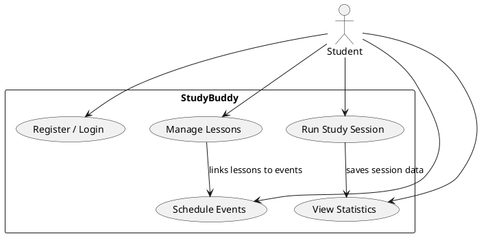

# StudyBuddy

StudyBuddy is a minimalist, multilingual study planner aimed at students (and busy learners in general). The application combines lesson management, time-blocking timers, and productivity analytics in a single experience while keeping cognitive load low.

## Vision

- **Audience:** Primarily university students (18-25) and professionals with packed schedules.
- **Experience Goals:** Calm, modern, and distraction-free UI with effortless multilingual switching (EN, TR, CS).
- **Key Pillars:** Simple authentication, colorful lesson catalog + calendar, guided study timers, and actionable analytics.

## Solution Overview

```
StudyBuddy/
├── backend/                # Express.js API + MySQL integration
│   ├── package.json
│   ├── src/
│   │   ├── app.js          # Express app bootstrap
│   │   ├── config/         # env + database pooling
│   │   ├── middleware/     # auth + validation helpers
│   │   ├── routes/         # feature routes (auth, lessons, study, stats)
│   │   └── controllers/    # business logic per feature
│   └── sql/
│       └── schema.sql      # DB DDL + seed helpers
├── frontend/
│   ├── index.html
│   ├── assets/
│   │   ├── css/
│   │   │   └── styles.css
│   │   └── js/
│   │       ├── main.js
│   │       ├── i18n.js
│   │       ├── auth.js
│   │       ├── lessons.js
│   │       ├── study-room.js
│   │       └── stats.js
└── README.md
```

### Frontend (Vanilla JS + Custom CSS)

- **Minimalist Layout:** Four main tabs (Auth, Lessons & Calendar, Study Room, Statistics).
- **Typography:** Inter (via Google Fonts import), with generous whitespace and soft palette.
- **Multilingual Engine:** All static copy is driven by `translations` in `assets/js/i18n.js`; elements use `data-i18n` attributes. Language switcher updates text instantly without reloads.
- **State Management:** Simple module-scoped state with localStorage caching for JWT token, selected language, and quick lesson lookups.
- **Timer Logic:** Modular countdown utilities for Pomodoro, Ultra-Dian, and custom Timebox modes with UI feedback.
- **Charts:** Lightweight canvas-based charts (Chart.js CDN) for weekly totals, per-lesson distribution, productive hours, and technique success.

### Backend (Node.js + Express + MySQL)

- **Structure:** Feature folders (controllers + routes) backed by shared services for database access using `mysql2/promise`.
- **Auth:** Registration/login with bcrypt password hashing, JWT issuance, and protected routes leveraging bearer tokens.
- **Lessons:** CRUD endpoints, color validation, and calendar events association.
- **Study Sessions:** Timer completion/abort triggers session persistence, storing duration, timestamps, and technique.
- **Statistics:** Aggregated queries (weekly/monthly totals, per-lesson pies, peak focus hours, technique completion counts).
- **Validation & Errors:** celebrate/Joi schemas for request validation, consistent API error payloads.

### Database Schema (MySQL)

Key tables:

- `users` – stores username, email, hashed password, and preferred language.
- `lessons` – per-user lessons with color codes and optional description.
- `study_sessions` – records duration, technique, timestamps, and linking to lessons.
- `lesson_events` – optional calendar events (exam dates, deadlines).

Relations use foreign keys with cascading deletes on user removal.

### Security

- Password hashing via bcrypt (12 rounds).
- JWT access tokens with 1-hour expiration, refresh via re-login (MVP).
- `.env` configuration for DB credentials and JWT secrets (see `.env.example`).
- CORS configured to allow the frontend origin.

### Local Development

1. **Backend**
   - `cd backend`
   - `cp .env.example .env` and populate DB + JWT details.
   - `npm install`
   - `npm run dev` (nodemon)

2. **Database**
   - Create a MySQL database (e.g., `studybuddy`).
   - Run `sql/schema.sql`.

3. **Frontend**
   - Static assets; use `live-server` or `npm install -g serve` then `serve frontend`.
   - For Windows + PowerShell: `npx http-server ./frontend -c-1`.

### Upcoming Steps

- Implement expressed architecture (backend services + frontend modules).
- Harden validation and error handling.
- Write integration tests (Supertest + Jest) and manual QA scripts.
- Iterate on UX polish and add progressive enhancements (notifications, offline caching).

---

This document will evolve as implementation proceeds. Refer to feature-specific READMEs or inline documentation once development is underway.

## Product Documentation

### Business Story (1/2 A4)
Students juggle lectures, language transitions, and time zones while trying to keep a sustainable study rhythm.
StudyBuddy gives them one calm surface to plan lessons, block focus time, and see progress. A student signs in once, sets their language (EN/TR/CS), and quickly builds a color-coded lesson catalog. 
They drop exam dates or deadlines onto the calendar, then run guided timers (Pomodoro, Ultradian, or custom) from the same place. After each session, StudyBuddy logs outcomes and feeds charts that reveal productive hours,
technique success, and lesson balance. Lightweight APIs keep sync between web clients and a MySQL backend, while JWT-protected endpoints ensure only the student’s data is touched.
The product goal is to lower cognitive overhead for fast-moving students so they spend less time organizing and more time studying.

### Use Cases + Scenarios (UML)

- Scenario A: Student registers, sets preferred language, logs in, and sees empty dashboard.
- Scenario B: Adds lessons with colors, links exam dates in calendar, then runs a 45m timer; session is stored and shown in charts.
- Scenario C: Logs back in on another device; JWT authorizes, lessons/events/sessions load, charts update without re-entry.

### Functional Requirements
- Users can register/login, set language, and maintain authenticated sessions via JWT.
- CRUD for lessons with color validation; calendar events optionally tied to lessons.
- Start/stop/abort study sessions with technique + duration captured and persisted.
- Statistics endpoints return aggregates (weekly totals, per-lesson distribution, peak hours, technique success).
- Profile updates for language preference and basic details.

### Non-Functional Requirements
- Security: bcrypt password hashing, JWT expiration (1h), CORS restricted to frontend origin, env-based secrets.
- Performance: API p95 < 300ms for typical CRUD/stat calls under student-scale load.
- Reliability: graceful error handling with consistent error payloads; DB constraints prevent orphaned records.
- Localization: UI text fully driven by translation maps; language switch is instant client-side.
- Maintainability: feature-based backend folders; plain JS frontend modules with minimal global state.

### App Architecture
- Frontend: Vanilla JS + CSS, modular scripts per feature, localStorage for token/lang cache, chart rendering via Chart.js CDN.
- Backend: Express.js with route/controller/service layering; async DB access via `mysql2/promise`; middleware for auth, validation, error handling.
- Integration: REST over HTTPS; JWT bearer auth; CORS configured to permit the web origin.

### UI Overview
- Screens: Login/Register, Dashboard (tabs: Lessons & Calendar, Study Room, Statistics, Profile).
- Lessons & Calendar: color-coded lessons, event list, day/week calendar.
- Study Room: timer controls (Pomodoro/Ultradian/custom), session status, quick lesson pick.
- Statistics: cards + charts for totals, distribution, focus hours, technique success.
- Profile: language switcher, basic preferences.

### Database Design
- Core tables: `users`, `lessons` (FK user), `lesson_events` (FK lesson), `study_sessions` (FK lesson + user).
- Constraints: foreign keys with cascades on user delete; indexed on user_id + timestamps for fast stats.
- See `backend/sql/schema.sql` for DDL.

### API Surface (high level)
- Auth: `POST /auth/register`, `POST /auth/login`, token-protected routes via bearer JWT.
- Lessons: `GET/POST/PATCH/DELETE /lessons`, color validation in controller.
- Events: `GET/POST/PATCH/DELETE /events`, optional lesson linkage.
- Study: `POST /study/sessions` (start/stop payload), `GET /study/sessions` history.
- Stats: `GET /stats/summary`, `GET /stats/focus-hours`, `GET /stats/techniques`.
- Profile: `GET/PUT /profile` for preferences (language).

### Business Logic Highlights
- Auth flow issues JWT on login; middleware guards protected routes.
- Lesson creation validates palette + ownership; deleting a user cascades to lessons/events/sessions.
- Study session endpoints validate technique + duration, persist results, then feed stat queries.
- Stats services aggregate by timeframe, lesson, and technique; controllers shape chart-ready responses.
